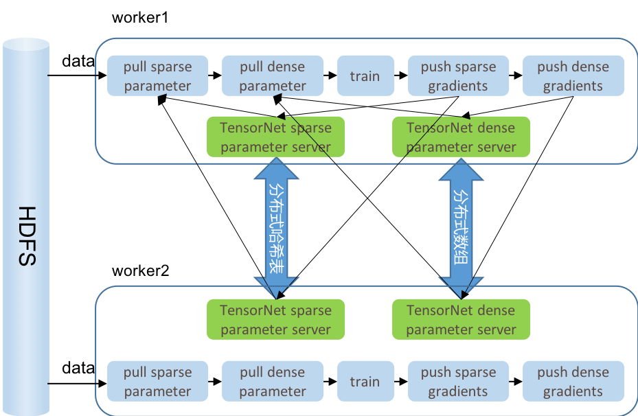
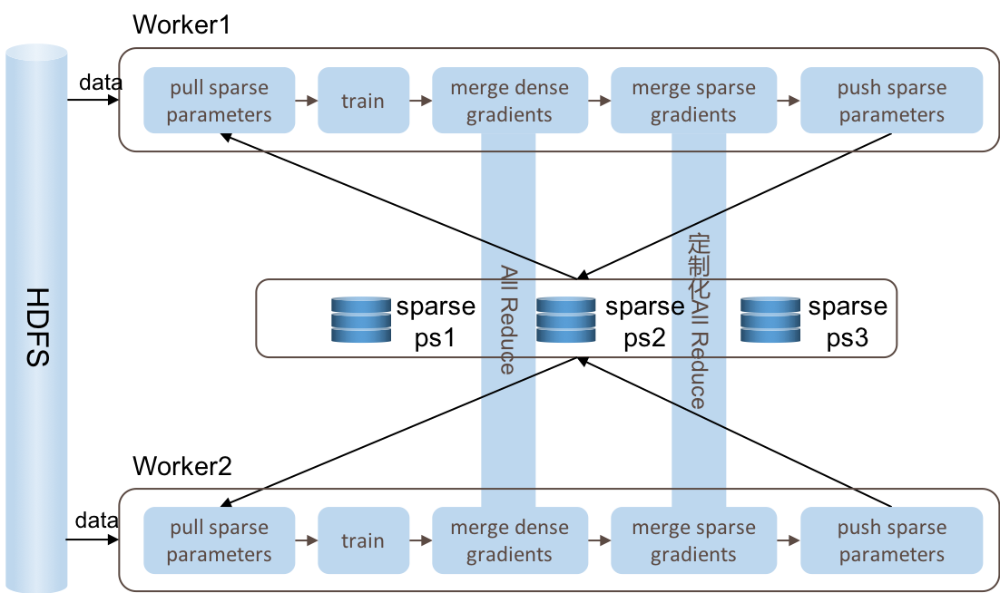
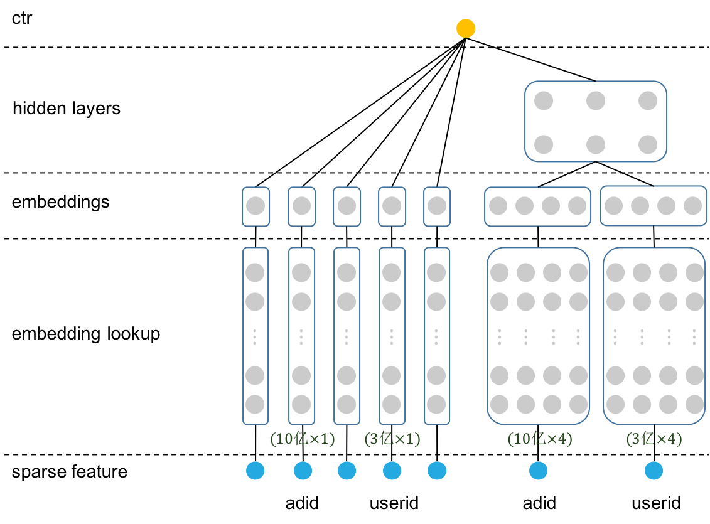
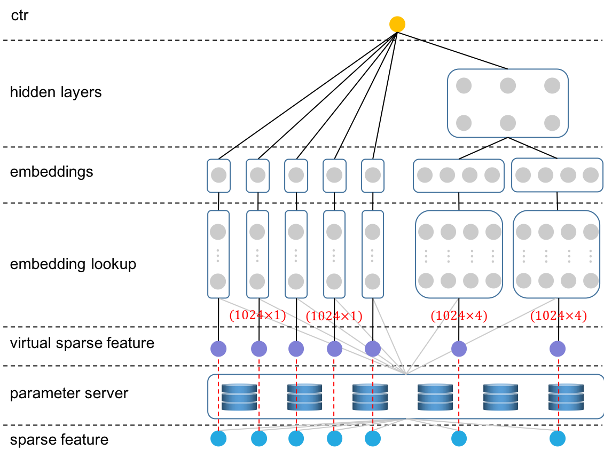
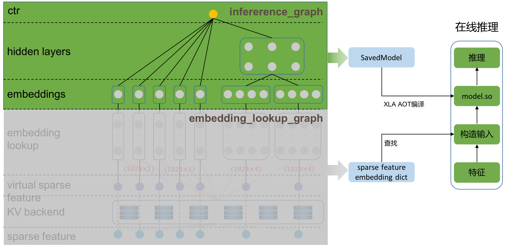

**TensorNet**是一个构建在**TensorFlow**之上针对广告推荐等大规模稀疏场景优化的分布式训练框架。TensorNet的目标是让所有使用TensorFlow的开发者可以快速的、方便的训练出稀疏参数超过百亿的超大模型。

## TensorNet训练架构

TensorNet支持异步和同步模式训练。异步模式在仅有CPU的集群中速度提升十分显著，同步模式在网卡速度超过100GbE的GPU集群中表现突出。

### TensorNet异步训练架构

在仅有CPU的集群中使用参数服务器的异步训练模式是训练模型速度最快的方法，TensorNet异步训练架构与TensorFlow的异步训练架构有很大的区别：

1. TensorNet将sparse参数和与dense参数分别使用不同的parameter server管理。
2. TensorNet不设单独的parameter server节点。在每个worker中都会维护一个sparse paramter server和dense parameter server。这省去了开发人员管理ps节点和worker节点的不少麻烦。
3. TensorNet对sparse参数使用分布式哈希表按照哈希值均匀分布不同的节点上。这相较于TensorFlow需要让开发者根据自身情况将tensor分布在不同的ps节点上的方法更加灵活，这不仅减小了节点通信热点的概率，还减轻了开发者的工作量。
4. TensorNet将模型的所有dense参数合并后使用分布式数组切分到不同的机器上，每次pull和push参数的时候只有一次网络请求。相较于TensorFlow对每个tensor都有一次网络请求的方法极大的减少了网络请求的次数从而提升了模型训练的速度。

### TensorNet同步训练架构

TensorNet同步训练架构基本与TensorFlow的MultiWorkerMirroredStrategy架构一致，主要区别如下：

1. TensorNet使用单独的sparse parameter server节点保存所有sparse参数。通过parameter server可以解决TensorFlow支持的sparse特征维度不能太大的问题。
2. TensorNet对sparse参数做了特殊的定制化的同步。TensorNet在训练时由于每个batch内的sparse参数的`IndexedSlices`指向的内容与TensorFlow默认的不同，我们对此做了定制化的同步。

注：当前release的版本中不包含同步版，同步版还未完成稳定性测试，等测试稳定了会很快发布。

## TensorNet离线训练优化

TensorNet最核心的优化是将模型的embedding tensor优化到了最小。

如下图所示，对于最简单的wide&deep模型，如果在一个广告系统中有3亿用户，那么就需要定义一个维度为3亿的embedding矩阵，在训练模型时需要在这个3亿维的矩阵上做`embedding_lookup`得到当前batch内的用户的embedding信息，进而在embedding之上做更加复杂的操作。

显而易见，在高维稀疏场景下embedding矩阵太大，占用内存多。当特征较多的时候单机无法存储整个模型。

**TensorNet使用一个较小的，可以容纳特征在一个batch内所有数据的embedding矩阵代替TensorFlow默认实现中需要定义的较大的embedding矩阵**。

如下图所示，在batch_size设置为1024的场景下，对于用户id特征，在TensorNet中只需要定义一个维度为1024的embedding矩阵，TensorNet的主要处理步骤如下：

1. 定义模型时定义userid的embedding矩阵的维度为一个batch内所有用户id个数的最大值。
2. 训练模型时得到当前batch内的所有用户id。
3. 将用户id排序，并按照先后顺序为每个userid分配索引，索引从0开始，对应为下图中的`virtual sparse feature`。
4. 使用userid从parameter server中获取相应的embedding向量，然后按照其对应的索引放置到embedding矩阵中。
5. 使用转换后的`virtual sparse feature`作为模型的输入。

从上述可见，TensorNet由于极大的减小了模型所需要的embedding矩阵，通过parameter server的方式使得稀疏特征的维度可以支持到接近无限维，从而可以极大的提升模型的刻画能力。

## TensorNet Inference优化

由于TensorNet只更改了模型的第一层，从而模型的inference也变得极其简单。

在使用TensorNet构造模型的时候，可以将模型切分为两部分，如下图所示，`embedding_lookup_graph`只在离线训练时使用，在线inference时只需要将sparse embedding导出成字典供`inference_graph`作为输入即可，具体的请参考：[为inference准备——模型切分](doc/tutorial/03-split-to-sub-graph.ipynb)，[使用XLA方式进行在线预估](doc/tutorial/04-deploy-tf-graph-online.ipynb)，[sparse embedding字典导出](doc/tutorial/05-export-sparse-feature-embedding.ipynb)系列文档。

## 文档

1. [编译与部署](doc/compile_deploy.md)
2. [quick start with wide deep](doc/tutorial/01-begin-with-wide-deep.ipynb)
3. [在集群上运行](doc/tutorial/02-run-in-cluster.ipynb)
4. [为inference准备——模型切分](doc/tutorial/03-split-to-sub-graph.ipynb)
5. [使用XLA方式进行在线预估](doc/tutorial/04-deploy-tf-graph-online.ipynb)
6. [sparse embedding字典导出](doc/tutorial/05-export-sparse-feature-embedding.ipynb)

## License

[Apache License 2.0](LICENSE)

## concat us

email: 张彦升(zhangyansheng@360.cn),姚磊(yaolei@360.cn)

